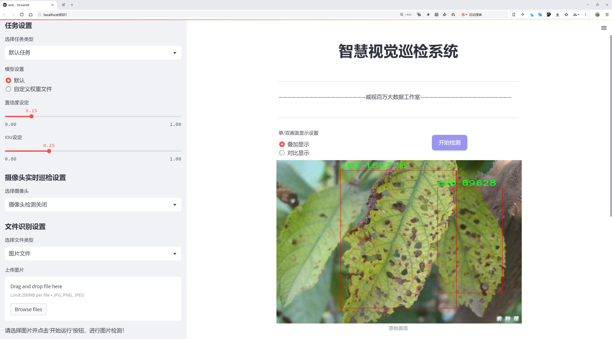
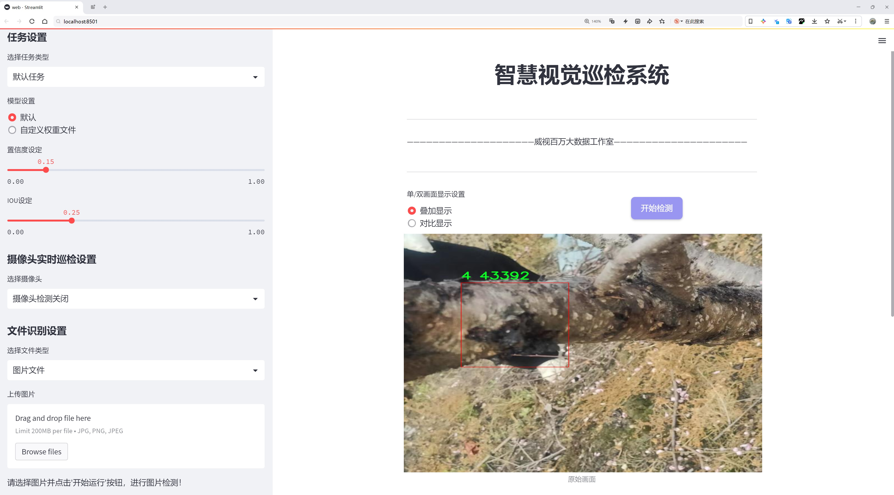
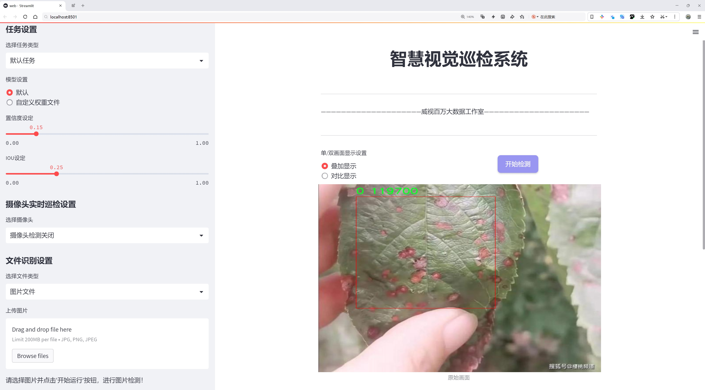
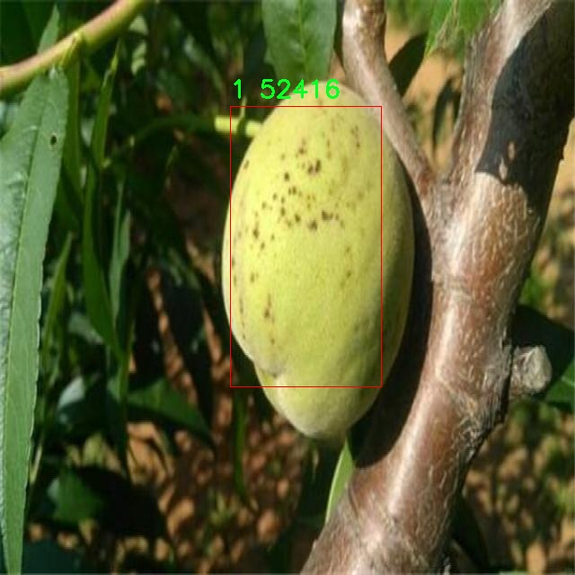
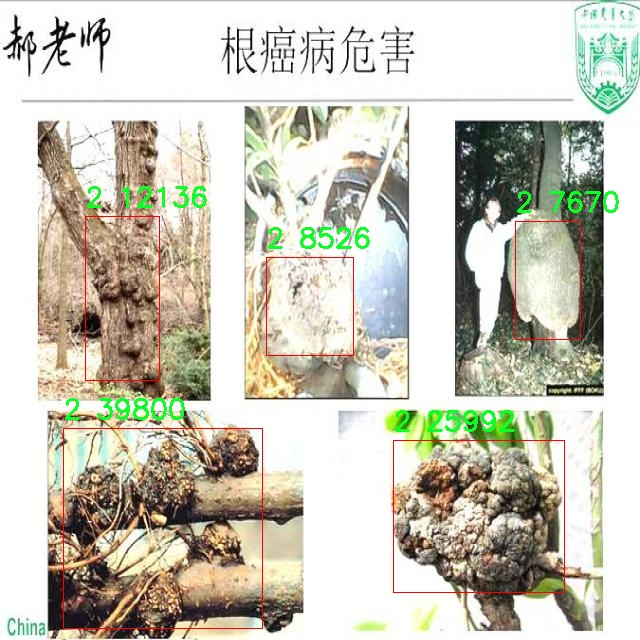
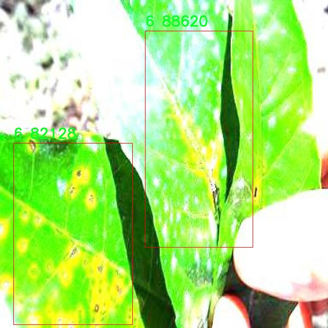
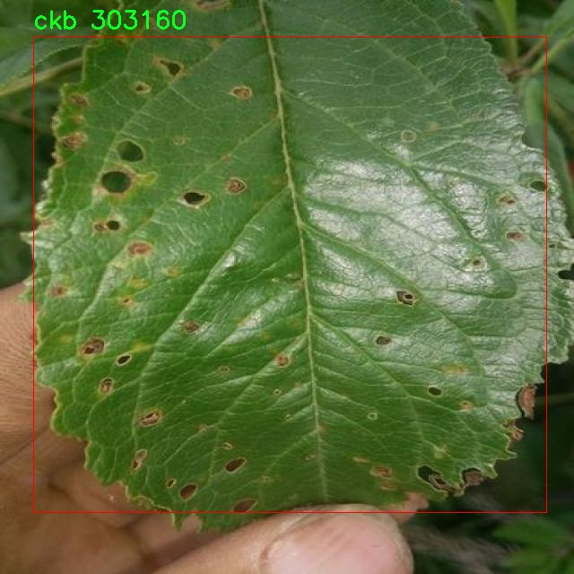
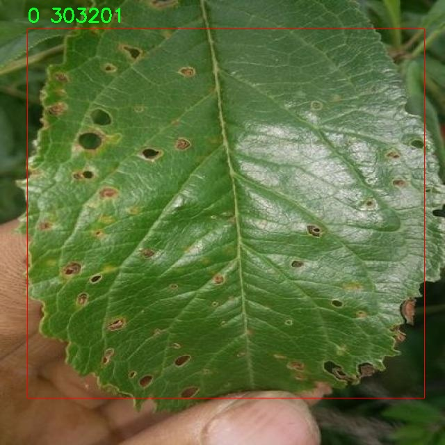

# 黄桃病害检测检测系统源码分享
 # [一条龙教学YOLOV8标注好的数据集一键训练_70+全套改进创新点发刊_Web前端展示]

### 1.研究背景与意义

项目参考[AAAI Association for the Advancement of Artificial Intelligence](https://gitee.com/qunmasj/projects)

项目来源[AACV Association for the Advancement of Computer Vision](https://kdocs.cn/l/cszuIiCKVNis)

研究背景与意义

随着全球农业生产的不断发展，病害的监测与管理成为了提高作物产量和质量的重要环节。黄桃作为一种经济价值较高的水果，其种植面积逐年扩大，但病害问题也随之而来，严重影响了黄桃的产量和品质。传统的病害检测方法往往依赖于人工观察，不仅效率低下，而且容易受到主观因素的影响，导致漏检或误检的情况频繁发生。因此，亟需一种高效、准确的病害检测系统，以便及时发现和处理黄桃病害，从而保障黄桃的健康生长和产量。

近年来，深度学习技术的迅猛发展为农业病害检测提供了新的解决方案。YOLO（You Only Look Once）系列模型因其高效的实时目标检测能力，逐渐成为计算机视觉领域的研究热点。YOLOv8作为该系列的最新版本，具有更强的特征提取能力和更快的推理速度，适合于复杂的农业环境中进行病害检测。然而，现有的YOLOv8模型在特定农业应用场景中的表现仍有待提升，尤其是在黄桃病害的识别精度和适应性方面。因此，基于改进YOLOv8的黄桃病害检测系统的研究具有重要的理论意义和实际应用价值。

本研究所使用的数据集包含5100张黄桃病害图像，涵盖了12个不同的病害类别，包括常见的黄桃病害如果腐病、白粉病等。这些数据的丰富性为模型的训练和验证提供了坚实的基础。通过对这些图像进行标注和分类，研究者能够利用深度学习算法对不同病害进行精准识别，从而为黄桃种植者提供科学的病害管理建议。此外，数据集的多样性和代表性使得模型能够更好地适应不同生长环境和气候条件下的黄桃病害检测需求。

在技术层面，本研究将对YOLOv8模型进行改进，结合迁移学习和数据增强等技术手段，以提升模型在黄桃病害检测中的准确性和鲁棒性。通过优化模型结构和训练策略，力求在保证检测速度的同时，提高对小目标和复杂背景下病害的识别能力。这不仅有助于提高黄桃病害检测的效率，也为其他农作物的病害检测提供了可借鉴的思路。

综上所述，基于改进YOLOv8的黄桃病害检测系统的研究，不仅填补了当前农业病害检测领域的技术空白，还为实现智能农业、提高黄桃生产效率提供了重要的理论支持和实践指导。通过本研究的实施，期望能够为黄桃种植者提供一种高效、便捷的病害检测工具，进而推动黄桃产业的可持续发展。

### 2.图片演示







##### 注意：由于此博客编辑较早，上面“2.图片演示”和“3.视频演示”展示的系统图片或者视频可能为老版本，新版本在老版本的基础上升级如下：（实际效果以升级的新版本为准）

  （1）适配了YOLOV8的“目标检测”模型和“实例分割”模型，通过加载相应的权重（.pt）文件即可自适应加载模型。

  （2）支持“图片识别”、“视频识别”、“摄像头实时识别”三种识别模式。

  （3）支持“图片识别”、“视频识别”、“摄像头实时识别”三种识别结果保存导出，解决手动导出（容易卡顿出现爆内存）存在的问题，识别完自动保存结果并导出到tempDir中。

  （4）支持Web前端系统中的标题、背景图等自定义修改，后面提供修改教程。

  另外本项目提供训练的数据集和训练教程,暂不提供权重文件（best.pt）,需要您按照教程进行训练后实现图片演示和Web前端界面演示的效果。

### 3.视频演示

[3.1 视频演示](https://www.bilibili.com/video/BV1L8xPeFEWg/)

### 4.数据集信息展示

##### 4.1 本项目数据集详细数据（类别数＆类别名）

nc: 12
names: ['0', '1', '2', '3', '4', '5', '6', 'cjb', 'ckb', 'gab', 'hfb', 'tjb']


##### 4.2 本项目数据集信息介绍

数据集信息展示

在现代农业中，作物病害的及时检测与处理至关重要，尤其是在黄桃的种植过程中，病害的发生不仅影响了果实的质量和产量，还可能对整个生态系统造成负面影响。为此，我们构建了一个专门用于训练改进YOLOv8的黄桃病害检测系统的数据集，命名为“Yello peach disease”。该数据集旨在通过深度学习技术，提高黄桃病害的识别率，从而为农民提供更为高效的病害管理工具。

“Yello peach disease”数据集包含12个类别，涵盖了黄桃常见的多种病害。这些类别的命名为：'0', '1', '2', '3', '4', '5', '6', 'cjb', 'ckb', 'gab', 'hfb', 'tjb'。这些类别的设计不仅考虑了病害的多样性，还兼顾了实际应用中的可操作性。每个类别代表了一种特定的病害或病害的不同阶段，便于系统在实际应用中进行精准的识别与分类。

在数据集的构建过程中，我们收集了大量的黄桃病害图像，确保每个类别的样本数量充足且多样化。这些图像来源于不同的生长环境和气候条件，涵盖了黄桃在不同生长阶段所遭受的各种病害。这种多样性不仅提高了模型的泛化能力，也使得训练出的模型能够在不同的实际场景中有效应用。

数据集中的图像经过精心标注，确保每个病害的特征清晰可辨。我们采用了高分辨率的图像，以便在检测过程中捕捉到细微的病害特征。这对于YOLOv8模型的训练至关重要，因为模型的性能在很大程度上依赖于输入数据的质量。为了进一步增强数据集的实用性，我们还进行了数据增强处理，包括旋转、缩放、翻转等操作，以增加模型的鲁棒性。

此外，数据集的设计也考虑到了模型训练的效率。我们将图像按照类别进行了合理的分配，确保每个类别在训练和验证集中的比例适当。这种平衡有助于避免模型在某些类别上过拟合，同时提高了整体的检测精度。通过这样的数据集构建，我们希望能够为研究人员和农民提供一个强有力的工具，以便在黄桃种植过程中，能够及时发现并处理病害，降低损失，提高产量。

综上所述，“Yello peach disease”数据集不仅是一个丰富的黄桃病害图像库，更是推动黄桃病害检测技术进步的重要基础。通过对该数据集的深入研究与应用，我们期待能够实现更高效的病害检测，助力现代农业的发展与可持续性。











### 5.全套项目环境部署视频教程（零基础手把手教学）

[5.1 环境部署教程链接（零基础手把手教学）](https://www.ixigua.com/7404473917358506534?logTag=c807d0cbc21c0ef59de5)


[5.2 安装Python虚拟环境创建和依赖库安装视频教程链接（零基础手把手教学）](https://www.ixigua.com/7404474678003106304?logTag=1f1041108cd1f708b01a)

### 6.手把手YOLOV8训练视频教程（零基础小白有手就能学会）

[6.1 手把手YOLOV8训练视频教程（零基础小白有手就能学会）](https://www.ixigua.com/7404477157818401292?logTag=d31a2dfd1983c9668658)

### 7.70+种全套YOLOV8创新点代码加载调参视频教程（一键加载写好的改进模型的配置文件）

[7.1 70+种全套YOLOV8创新点代码加载调参视频教程（一键加载写好的改进模型的配置文件）](https://www.ixigua.com/7404478314661806627?logTag=29066f8288e3f4eea3a4)

### 8.70+种全套YOLOV8创新点原理讲解（非科班也可以轻松写刊发刊，V10版本正在科研待更新）

由于篇幅限制，每个创新点的具体原理讲解就不一一展开，具体见下列网址中的创新点对应子项目的技术原理博客网址【Blog】：


[8.1 70+种全套YOLOV8创新点原理讲解链接](https://gitee.com/qunmasj/good)

### 9.系统功能展示（检测对象为举例，实际内容以本项目数据集为准）

图9.1.系统支持检测结果表格显示

  图9.2.系统支持置信度和IOU阈值手动调节

  图9.3.系统支持自定义加载权重文件best.pt(需要你通过步骤5中训练获得)

  图9.4.系统支持摄像头实时识别

  图9.5.系统支持图片识别

  图9.6.系统支持视频识别

  图9.7.系统支持识别结果文件自动保存

  图9.8.系统支持Excel导出检测结果数据


### 10.原始YOLOV8算法原理

原始YOLOv8算法原理

YOLOv8作为YOLO系列中的最新版本，继承并扩展了前几代模型的设计理念，展现出更为卓越的目标检测能力。其核心架构由三个主要部分构成：Backbone、Neck和Head，每个部分在整体功能中扮演着不可或缺的角色。首先，Backbone负责从输入图像中提取特征，采用了CSPDarknet结构，具有更强的特征提取能力。CSPDarknet通过将网络分为两个部分，每个部分都包含多个残差块，极大地增强了模型对复杂特征的捕捉能力。与前代YOLOv5相比，YOLOv8s引入了C2f模块，这一模块的设计使得输入特征图被分为两个分支，经过卷积层降维后再进行融合，从而形成更高维度的特征图。这种分支结构不仅提升了特征图的表达能力，还通过引入v8_C2fBottleneck层，进一步丰富了模型的梯度流信息，使得特征提取过程更加高效。

在特征提取的过程中，YOLOv8还采用了快速空间金字塔池化（SPPF）结构，这一设计旨在提取不同尺度的特征，尤其在处理多尺度目标时表现出色。SPPF的引入有效减少了模型的参数量和计算量，同时提升了特征提取的效率，使得YOLOv8在速度和准确度之间达成了良好的平衡。

接下来，Neck部分采用了特征金字塔网络（FPN）与路径聚合网络（PAN）的结合结构，这一设计使得不同尺度的特征图能够通过上采样和下采样的方式进行有效融合，进而增强了模型对目标的检测能力。通过多层卷积和池化操作，Neck部分能够处理和压缩特征图，从而为后续的目标检测提供更加丰富的特征信息。

在目标检测的实现上，YOLOv8采用了一种创新的无锚框（Anchor-Free）检测方式。与传统的Anchor-based方法相比，这种新方式直接预测目标的中心点及其宽高比例，显著减少了Anchor框的数量，从而提高了检测速度和准确度。这一改进使得YOLOv8在复杂场景下，尤其是小目标检测方面表现得更加出色。

值得注意的是，YOLOv8在训练过程中引入了多种数据增强技术，包括马赛克数据增强、自适应图片缩放和灰度填充等。这些技术不仅提高了模型的鲁棒性，还有效地扩展了训练数据的多样性，使得模型在面对不同环境和背景时能够保持良好的检测性能。此外，YOLOv8在损失计算方面也进行了优化，采用了BCE（Binary Cross-Entropy）作为分类损失，DFL（Distribution Focal Loss）和CIoU（Complete Intersection over Union）作为回归损失，这些改进使得模型在训练过程中能够更好地适应不同类型的目标。

总的来说，YOLOv8在设计上融合了多种先进的网络结构和技术，展现出强大的目标检测能力。其高效的特征提取和目标检测方式，使得YOLOv8在速度和准确度上均有显著提升，成为了目标检测领域中的一项重要进展。尽管在复杂水面环境下仍然存在一些挑战，如小目标的定位误差和对目标感知能力不足等问题，但YOLOv8的基础架构和创新设计为后续的改进和优化提供了坚实的基础。未来的研究可以在此基础上，进一步探索如何提升YOLOv8在特定场景下的表现，以实现更广泛的应用。


### 11.项目核心源码讲解（再也不用担心看不懂代码逻辑）

#### 11.1 70+种YOLOv8算法改进源码大全和调试加载训练教程（非必要）\ultralytics\solutions\object_counter.py

以下是经过简化和注释的核心代码部分，保留了主要功能和逻辑：

```python
# 导入必要的库
from collections import defaultdict
import cv2
from shapely.geometry import Polygon, Point
from ultralytics.utils.plotting import Annotator, colors

class ObjectCounter:
    """管理实时视频流中对象计数的类。"""

    def __init__(self):
        """初始化计数器，设置默认参数。"""
        # 鼠标事件相关
        self.is_drawing = False  # 是否正在绘制
        self.selected_point = None  # 选中的点

        # 区域信息
        self.reg_pts = None  # 区域点
        self.counting_region = None  # 计数区域
        self.region_color = (255, 255, 255)  # 区域颜色

        # 图像和注释信息
        self.im0 = None  # 当前图像
        self.annotator = None  # 注释器

        # 对象计数信息
        self.in_counts = 0  # 进入计数
        self.out_counts = 0  # 离开计数
        self.counting_list = []  # 计数列表

        # 跟踪信息
        self.track_history = defaultdict(list)  # 跟踪历史
        self.track_thickness = 2  # 跟踪线厚度
        self.draw_tracks = False  # 是否绘制轨迹

    def set_args(self, classes_names, reg_pts, region_color=None, line_thickness=2, track_thickness=2, view_img=False, draw_tracks=False):
        """
        配置计数器的参数，包括类名、区域点和绘制选项。

        Args:
            classes_names (dict): 类别名称
            reg_pts (list): 定义计数区域的点
            region_color (tuple): 区域线的颜色
            line_thickness (int): 边框线的厚度
            track_thickness (int): 跟踪线的厚度
            view_img (bool): 是否显示视频流
            draw_tracks (bool): 是否绘制轨迹
        """
        self.reg_pts = reg_pts  # 设置区域点
        self.counting_region = Polygon(self.reg_pts)  # 创建计数区域多边形
        self.names = classes_names  # 设置类别名称
        self.region_color = region_color if region_color else self.region_color  # 设置区域颜色
        self.tf = line_thickness  # 设置线厚度
        self.view_img = view_img  # 设置是否显示图像
        self.track_thickness = track_thickness  # 设置跟踪线厚度
        self.draw_tracks = draw_tracks  # 设置是否绘制轨迹

    def extract_and_process_tracks(self, tracks):
        """
        提取并处理跟踪数据，更新计数和绘制信息。

        Args:
            tracks (list): 从对象跟踪过程中获得的跟踪数据。
        """
        boxes = tracks[0].boxes.xyxy.cpu()  # 获取边界框
        clss = tracks[0].boxes.cls.cpu().tolist()  # 获取类别
        track_ids = tracks[0].boxes.id.int().cpu().tolist()  # 获取跟踪ID

        self.annotator = Annotator(self.im0, self.tf, self.names)  # 初始化注释器
        self.annotator.draw_region(reg_pts=self.reg_pts, color=(0, 255, 0))  # 绘制计数区域

        for box, track_id, cls in zip(boxes, track_ids, clss):
            self.annotator.box_label(box, label=self.names[cls], color=colors(int(cls), True))  # 绘制边界框

            # 更新跟踪历史
            track_line = self.track_history[track_id]
            track_line.append((float((box[0] + box[2]) / 2), float((box[1] + box[3]) / 2)))  # 添加当前中心点
            track_line.pop(0) if len(track_line) > 30 else None  # 限制历史长度

            # 计数对象
            if self.counting_region.contains(Point(track_line[-1])):  # 检查中心点是否在计数区域内
                if track_id not in self.counting_list:  # 如果该ID未被计数
                    self.counting_list.append(track_id)  # 添加到计数列表
                    if box[0] < self.counting_region.centroid.x:  # 判断是进入还是离开
                        self.out_counts += 1
                    else:
                        self.in_counts += 1

        # 显示计数信息
        if self.view_img:
            incount_label = 'InCount : ' + f'{self.in_counts}'
            outcount_label = 'OutCount : ' + f'{self.out_counts}'
            self.annotator.count_labels(in_count=incount_label, out_count=outcount_label)  # 显示计数标签
            cv2.imshow('Ultralytics YOLOv8 Object Counter', self.im0)  # 显示图像
            if cv2.waitKey(1) & 0xFF == ord('q'):  # 按'q'退出
                return

    def start_counting(self, im0, tracks):
        """
        启动对象计数过程。

        Args:
            im0 (ndarray): 当前视频流帧。
            tracks (list): 从对象跟踪过程中获得的跟踪数据。
        """
        self.im0 = im0  # 存储当前图像
        if tracks[0].boxes.id is None:  # 如果没有跟踪ID，返回
            return
        self.extract_and_process_tracks(tracks)  # 提取并处理跟踪数据

if __name__ == '__main__':
    ObjectCounter()  # 创建对象计数器实例
```

### 代码核心功能
1. **对象计数器类 (`ObjectCounter`)**：管理对象计数的主要逻辑。
2. **初始化方法 (`__init__`)**：设置初始参数和状态。
3. **参数设置方法 (`set_args`)**：配置计数器的参数。
4. **提取和处理跟踪数据 (`extract_and_process_tracks`)**：处理跟踪信息，更新计数和绘制结果。
5. **启动计数方法 (`start_counting`)**：开始计数过程，处理每一帧图像和跟踪数据。

### 注释说明
每个方法和重要代码行都有详细的中文注释，帮助理解其功能和作用。

这个文件定义了一个名为 `ObjectCounter` 的类，主要用于在实时视频流中管理对象的计数，基于对象的轨迹进行统计。代码的结构和功能可以分为几个部分。

首先，文件引入了一些必要的库，包括 `cv2`（OpenCV库）用于图像处理，`defaultdict` 用于存储对象的轨迹信息，以及 `shapely` 库中的 `Polygon` 和 `Point` 类用于处理几何形状和点。接着，代码检查了所需的库是否已安装。

在 `ObjectCounter` 类的初始化方法中，定义了一些默认值和属性，包括鼠标事件的状态、计数区域的信息、图像和注释信息、对象计数的统计信息、轨迹信息等。通过这些属性，类能够管理对象的计数和可视化。

`set_args` 方法用于配置计数器的参数，包括类名、计数区域的点、区域颜色、线条厚度等。该方法将这些参数存储在类的属性中，以便后续使用。

`mouse_event_for_region` 方法处理鼠标事件，允许用户通过鼠标在视频流中绘制和移动计数区域。根据鼠标的不同事件（如按下、移动和释放），该方法会更新计数区域的点。

`extract_and_process_tracks` 方法负责提取和处理对象的轨迹。它从传入的轨迹数据中获取边界框、类别和轨迹ID，并使用 `Annotator` 类绘制边界框和轨迹。该方法还会判断对象是否进入或离开计数区域，并更新计数。

`start_counting` 方法是对象计数过程的主函数。它接收当前帧图像和轨迹数据，并调用 `extract_and_process_tracks` 方法进行处理。如果没有检测到有效的轨迹ID，方法将直接返回。

最后，在文件的主程序部分，创建了 `ObjectCounter` 类的实例，尽管没有具体的执行逻辑，但这表明该类可以被用作对象计数的基础。

总体来说，这个文件实现了一个实时对象计数器，能够在视频流中动态跟踪和计数对象，并通过可视化的方式展示计数结果。

#### 11.2 ui.py

以下是经过简化并添加详细中文注释的核心代码部分：

```python
import sys
import subprocess

def run_script(script_path):
    """
    使用当前 Python 环境运行指定的脚本。

    参数:
        script_path (str): 要运行的脚本路径

    返回:
        None
    """
    # 获取当前 Python 解释器的路径
    python_path = sys.executable

    # 构建运行命令，使用 streamlit 运行指定的脚本
    command = f'"{python_path}" -m streamlit run "{script_path}"'

    # 执行命令，并等待其完成
    result = subprocess.run(command, shell=True)
    
    # 检查命令执行结果，如果返回码不为0，表示出错
    if result.returncode != 0:
        print("脚本运行出错。")

# 主程序入口
if __name__ == "__main__":
    # 指定要运行的脚本路径
    script_path = "web.py"  # 这里可以直接指定脚本名，假设它在当前目录下

    # 调用函数运行脚本
    run_script(script_path)
```

### 代码注释说明：
1. **导入模块**：导入 `sys` 和 `subprocess` 模块，前者用于获取当前 Python 解释器的路径，后者用于执行外部命令。
2. **run_script 函数**：定义一个函数，用于运行指定路径的 Python 脚本。
   - 使用 `sys.executable` 获取当前 Python 解释器的路径。
   - 构建命令字符串，使用 `streamlit` 模块运行指定的脚本。
   - 使用 `subprocess.run` 执行命令，并等待其完成。
   - 检查命令的返回码，如果不为0，则打印错误信息。
3. **主程序入口**：通过 `if __name__ == "__main__":` 确保只有在直接运行该脚本时才会执行以下代码。
   - 指定要运行的脚本路径，这里假设脚本在当前目录下。
   - 调用 `run_script` 函数执行指定的脚本。

这个程序文件名为 `ui.py`，其主要功能是使用当前的 Python 环境来运行一个指定的脚本，具体是通过 Streamlit 来启动一个 Web 应用。

首先，程序导入了必要的模块，包括 `sys`、`os` 和 `subprocess`。其中，`sys` 模块用于访问与 Python 解释器相关的变量和函数，`os` 模块提供了与操作系统交互的功能，而 `subprocess` 模块则用于创建新进程、连接到它们的输入/输出/错误管道，并获取它们的返回码。

接下来，程序从 `QtFusion.path` 模块中导入了 `abs_path` 函数，这个函数的作用是获取文件的绝对路径。

在 `run_script` 函数中，程序接收一个参数 `script_path`，这个参数是要运行的脚本的路径。函数首先获取当前 Python 解释器的路径，并将其存储在 `python_path` 变量中。然后，构建一个命令字符串，命令的格式是使用 Python 解释器运行 Streamlit，并指定要运行的脚本。这里使用了 `-m streamlit run` 来启动 Streamlit 应用。

接着，程序使用 `subprocess.run` 方法执行构建好的命令。如果命令执行的返回码不为零，说明脚本运行出错，程序会打印出错误信息。

在文件的最后部分，程序通过 `if __name__ == "__main__":` 判断是否是直接运行该脚本。如果是，则指定要运行的脚本路径为 `web.py`，并调用 `run_script` 函数来执行这个脚本。

总体来说，这个程序的主要目的是提供一个简单的接口来启动一个基于 Streamlit 的 Web 应用，用户只需修改脚本路径即可运行不同的应用。

#### 11.3 code\ultralytics\models\yolo\segment\train.py

以下是代码中最核心的部分，并附上详细的中文注释：

```python
from ultralytics.models import yolo
from ultralytics.nn.tasks import SegmentationModel
from ultralytics.utils import DEFAULT_CFG, RANK
from ultralytics.utils.plotting import plot_images, plot_results

class SegmentationTrainer(yolo.detect.DetectionTrainer):
    """
    扩展自 DetectionTrainer 类，用于基于分割模型的训练。
    """

    def __init__(self, cfg=DEFAULT_CFG, overrides=None, _callbacks=None):
        """初始化 SegmentationTrainer 对象，使用给定的参数。"""
        if overrides is None:
            overrides = {}
        overrides["task"] = "segment"  # 设置任务类型为分割
        super().__init__(cfg, overrides, _callbacks)  # 调用父类的初始化方法

    def get_model(self, cfg=None, weights=None, verbose=True):
        """返回使用指定配置和权重初始化的 SegmentationModel。"""
        # 创建一个分割模型实例，通道数为3，类别数为数据集中类别的数量
        model = SegmentationModel(cfg, ch=3, nc=self.data["nc"], verbose=verbose and RANK == -1)
        if weights:
            model.load(weights)  # 如果提供了权重，则加载权重

        return model  # 返回模型实例

    def get_validator(self):
        """返回用于验证 YOLO 模型的 SegmentationValidator 实例。"""
        self.loss_names = "box_loss", "seg_loss", "cls_loss", "dfl_loss"  # 定义损失名称
        return yolo.segment.SegmentationValidator(
            self.test_loader, save_dir=self.save_dir, args=copy(self.args), _callbacks=self.callbacks
        )  # 返回验证器实例

    def plot_training_samples(self, batch, ni):
        """创建训练样本图像的绘图，包含标签和框坐标。"""
        plot_images(
            batch["img"],  # 图像数据
            batch["batch_idx"],  # 批次索引
            batch["cls"].squeeze(-1),  # 类别标签
            batch["bboxes"],  # 边界框
            masks=batch["masks"],  # 掩码
            paths=batch["im_file"],  # 图像文件路径
            fname=self.save_dir / f"train_batch{ni}.jpg",  # 保存的文件名
            on_plot=self.on_plot,  # 绘图回调
        )

    def plot_metrics(self):
        """绘制训练/验证指标。"""
        plot_results(file=self.csv, segment=True, on_plot=self.on_plot)  # 保存结果图像
```

### 代码说明：
1. **导入必要的模块**：引入了 YOLO 模型、分割模型、默认配置和绘图工具。
2. **SegmentationTrainer 类**：继承自 `DetectionTrainer`，用于处理分割任务的训练。
3. **初始化方法**：设置任务类型为分割，并调用父类的初始化方法。
4. **获取模型**：创建并返回一个分割模型实例，支持加载预训练权重。
5. **获取验证器**：返回一个用于验证的分割验证器实例，并定义损失名称。
6. **绘制训练样本**：生成并保存训练样本的图像，包含标签和边界框信息。
7. **绘制指标**：绘制训练和验证过程中的指标，保存结果图像。

这个程序文件定义了一个用于训练分割模型的类 `SegmentationTrainer`，它继承自 `DetectionTrainer` 类，主要用于基于 YOLO（You Only Look Once）模型进行图像分割任务的训练。

首先，文件引入了一些必要的模块和类，包括 `copy`、`yolo` 模块、`SegmentationModel` 类、默认配置 `DEFAULT_CFG` 和 `RANK` 变量，以及用于绘图的 `plot_images` 和 `plot_results` 函数。

`SegmentationTrainer` 类的构造函数 `__init__` 接受配置参数 `cfg`、覆盖参数 `overrides` 和回调函数 `_callbacks`。如果没有提供覆盖参数，则初始化为空字典，并将任务类型设置为 "segment"。然后，它调用父类的构造函数进行初始化。

`get_model` 方法用于返回一个初始化的 `SegmentationModel` 实例，接受配置和权重参数。如果提供了权重，它会加载这些权重。该方法确保模型的通道数为 3，并根据数据集的类别数量进行初始化。

`get_validator` 方法返回一个 `SegmentationValidator` 实例，用于验证 YOLO 模型的性能。在此方法中，定义了损失名称，包括边界框损失、分割损失、分类损失和 DFL（Distribution Focal Loss）损失。

`plot_training_samples` 方法用于生成训练样本图像的可视化，显示图像、标签和边界框坐标。它使用 `plot_images` 函数将训练批次的图像及其相关信息绘制并保存为 JPEG 文件。

最后，`plot_metrics` 方法用于绘制训练和验证过程中的指标，调用 `plot_results` 函数生成结果图，并保存为 `results.png` 文件。

整体而言，这个文件实现了一个完整的分割模型训练框架，提供了模型初始化、验证和可视化功能，便于用户进行图像分割任务的训练和评估。

#### 11.4 70+种YOLOv8算法改进源码大全和调试加载训练教程（非必要）\ultralytics\models\sam\model.py

以下是代码中最核心的部分，并附上详细的中文注释：

```python
from pathlib import Path  # 导入Path类，用于处理文件路径

from ultralytics.engine.model import Model  # 从Ultralytics库导入Model基类
from ultralytics.utils.torch_utils import model_info  # 导入用于获取模型信息的工具

from .build import build_sam  # 导入构建SAM模型的函数
from .predict import Predictor  # 导入预测器类


class SAM(Model):
    """
    SAM（Segment Anything Model）接口类。

    SAM旨在进行可提示的实时图像分割。可以使用多种提示方式，如边界框、点或标签。该模型具有零-shot性能，并在SA-1B数据集上进行训练。
    """

    def __init__(self, model='sam_b.pt') -> None:
        """
        使用预训练模型文件初始化SAM模型。

        参数：
            model (str): 预训练SAM模型文件的路径。文件应具有.pt或.pth扩展名。

        异常：
            NotImplementedError: 如果模型文件扩展名不是.pt或.pth。
        """
        # 检查模型文件扩展名是否有效
        if model and Path(model).suffix not in ('.pt', '.pth'):
            raise NotImplementedError('SAM预测需要预训练的*.pt或*.pth模型。')
        super().__init__(model=model, task='segment')  # 调用父类构造函数，初始化模型

    def predict(self, source, stream=False, bboxes=None, points=None, labels=None, **kwargs):
        """
        对给定的图像或视频源执行分割预测。

        参数：
            source (str): 图像或视频文件的路径，或PIL.Image对象，或numpy.ndarray对象。
            stream (bool, optional): 如果为True，则启用实时流。默认为False。
            bboxes (list, optional): 用于提示分割的边界框坐标列表。默认为None。
            points (list, optional): 用于提示分割的点列表。默认为None。
            labels (list, optional): 用于提示分割的标签列表。默认为None。

        返回：
            (list): 模型的预测结果。
        """
        # 设置预测的覆盖参数
        overrides = dict(conf=0.25, task='segment', mode='predict', imgsz=1024)
        kwargs.update(overrides)  # 更新额外参数
        prompts = dict(bboxes=bboxes, points=points, labels=labels)  # 创建提示字典
        return super().predict(source, stream, prompts=prompts, **kwargs)  # 调用父类的预测方法

    def __call__(self, source=None, stream=False, bboxes=None, points=None, labels=None, **kwargs):
        """
        'predict'方法的别名。

        参数：
            source (str): 图像或视频文件的路径，或PIL.Image对象，或numpy.ndarray对象。
            stream (bool, optional): 如果为True，则启用实时流。默认为False。
            bboxes (list, optional): 用于提示分割的边界框坐标列表。默认为None。
            points (list, optional): 用于提示分割的点列表。默认为None。
            labels (list, optional): 用于提示分割的标签列表。默认为None。

        返回：
            (list): 模型的预测结果。
        """
        return self.predict(source, stream, bboxes, points, labels, **kwargs)  # 调用预测方法

    def info(self, detailed=False, verbose=True):
        """
        记录有关SAM模型的信息。

        参数：
            detailed (bool, optional): 如果为True，则显示有关模型的详细信息。默认为False。
            verbose (bool, optional): 如果为True，则在控制台显示信息。默认为True。

        返回：
            (tuple): 包含模型信息的元组。
        """
        return model_info(self.model, detailed=detailed, verbose=verbose)  # 获取模型信息

    @property
    def task_map(self):
        """
        提供从'segment'任务到其对应'预测器'的映射。

        返回：
            (dict): 将'segment'任务映射到其对应'预测器'的字典。
        """
        return {'segment': {'predictor': Predictor}}  # 返回任务映射
```

### 代码核心部分说明：
1. **类定义**：`SAM`类继承自`Model`类，提供了图像分割的功能。
2. **初始化方法**：检查模型文件的扩展名，并调用父类的初始化方法。
3. **预测方法**：实现了对图像或视频源的分割预测，支持多种提示方式。
4. **信息获取方法**：提供了获取模型信息的功能。
5. **任务映射**：定义了从分割任务到预测器的映射关系。

该程序文件是Ultralytics YOLO项目中的一个模块，主要用于实现Segment Anything Model（SAM）的接口。SAM模型专门设计用于实时图像分割任务，具有极高的灵活性，能够通过不同的提示（如边界框、点或标签）进行分割，并且在SA-1B数据集上进行了训练。该模型的一个重要特点是具备零-shot性能，意味着它可以在没有先前知识的情况下适应新的图像分布和任务。

在文件的开头，首先导入了一些必要的库和模块，包括`Path`类用于处理文件路径，`Model`类用于继承基础模型功能，以及`model_info`函数用于获取模型信息。接着，定义了一个名为`SAM`的类，继承自`Model`类，构造函数`__init__`接受一个模型文件路径作为参数，并检查文件扩展名是否为`.pt`或`.pth`，以确保加载的是预训练模型。

`_load`方法用于加载指定的权重文件，调用`build_sam`函数构建SAM模型。`predict`方法则实现了对给定图像或视频源的分割预测，支持实时流式处理，并允许用户通过边界框、点或标签提供提示。该方法返回模型的预测结果。

此外，`__call__`方法是`predict`方法的别名，方便用户以更直观的方式调用模型进行预测。`info`方法用于记录和显示有关SAM模型的信息，用户可以选择是否显示详细信息。

最后，`task_map`属性提供了一个从“segment”任务到其对应的“Predictor”的映射，方便在不同任务之间进行管理和调用。整体来看，该文件实现了SAM模型的基本功能，便于用户进行图像分割任务的处理和分析。

#### 11.5 70+种YOLOv8算法改进源码大全和调试加载训练教程（非必要）\ultralytics\utils\checks.py

以下是代码中最核心的部分，并附上详细的中文注释：

```python
import os
import platform
import subprocess
import sys
from pathlib import Path
from typing import Optional

import torch
from ultralytics.utils import LOGGER, ROOT, SimpleNamespace, parse_requirements

def check_python(minimum: str = '3.8.0') -> bool:
    """
    检查当前 Python 版本是否满足最低要求。

    参数:
        minimum (str): 所需的最低 Python 版本。

    返回:
        bool: 如果当前版本满足要求，返回 True；否则返回 False。
    """
    current_version = platform.python_version()  # 获取当前 Python 版本
    if current_version < minimum:
        LOGGER.warning(f'当前 Python 版本 {current_version} 不满足最低要求 {minimum}.')
        return False
    return True

def check_requirements(requirements=ROOT.parent / 'requirements.txt', exclude=(), install=True, cmds=''):
    """
    检查已安装的依赖项是否满足要求，并尝试自动更新。

    参数:
        requirements (Union[Path, str, List[str]]): requirements.txt 文件的路径，单个包要求字符串，或包要求字符串列表。
        exclude (Tuple[str]): 要排除的包名称元组。
        install (bool): 如果为 True，尝试自动更新不满足要求的包。
        cmds (str): 在自动更新时传递给 pip install 命令的附加命令。

    返回:
        bool: 如果所有要求都满足，返回 True；否则返回 False。
    """
    # 检查 Python 版本
    check_python()

    # 解析 requirements.txt 文件
    if isinstance(requirements, Path):
        file = requirements.resolve()
        assert file.exists(), f'未找到文件: {file}'
        requirements = [f'{x.name}{x.specifier}' for x in parse_requirements(file) if x.name not in exclude]
    elif isinstance(requirements, str):
        requirements = [requirements]

    # 检查每个要求
    pkgs = []
    for r in requirements:
        name, required = r.split('>=') if '>=' in r else (r, '')  # 解析包名称和要求
        try:
            current_version = metadata.version(name)  # 获取当前版本
            if current_version < required:
                pkgs.append(r)  # 如果不满足要求，添加到待更新列表
        except metadata.PackageNotFoundError:
            pkgs.append(r)  # 如果包未安装，添加到待更新列表

    # 如果有包需要更新
    if pkgs and install:
        s = ' '.join(f'"{x}"' for x in pkgs)  # 将待更新包转换为字符串
        LOGGER.info(f'发现需要更新的包: {s}, 尝试自动更新...')
        try:
            subprocess.check_output(f'pip install --no-cache {s}', shell=True)  # 执行 pip 更新命令
            LOGGER.info('自动更新成功 ✅')
        except Exception as e:
            LOGGER.warning(f'自动更新失败: {e}')
            return False

    return True

def check_cuda() -> bool:
    """
    检查 CUDA 是否可用。

    返回:
        bool: 如果可用，返回 True；否则返回 False。
    """
    try:
        output = subprocess.check_output(['nvidia-smi'], encoding='utf-8')  # 运行 nvidia-smi 命令
        return "NVIDIA-SMI" in output  # 检查输出中是否包含 NVIDIA-SMI
    except (subprocess.CalledProcessError, FileNotFoundError):
        return False  # 如果命令失败或未找到，返回 False

def collect_system_info():
    """
    收集并打印相关系统信息，包括操作系统、Python、RAM、CPU 和 CUDA。
    """
    ram_info = psutil.virtual_memory().total / (1024 ** 3)  # 获取总内存并转换为 GB
    LOGGER.info(f"\n{'操作系统':<20}{platform.platform()}\n"
                f"{'Python 版本':<20}{sys.version.split()[0]}\n"
                f"{'RAM':<20}{ram_info:.2f} GB\n"
                f"{'CUDA 可用':<20}{'是' if check_cuda() else '否'}\n")
```

### 代码核心部分解释：
1. **check_python**: 检查当前 Python 版本是否满足最低要求。
2. **check_requirements**: 检查依赖项是否满足要求，并在需要时自动更新。
3. **check_cuda**: 检查 CUDA 是否可用，以便在使用 GPU 时进行加速。
4. **collect_system_info**: 收集并打印系统信息，包括操作系统、Python 版本、内存和 CUDA 可用性。

这些函数是整个代码的核心部分，确保了环境的正确配置和依赖项的满足。

这个程序文件是一个用于YOLOv8算法的工具模块，主要包含了一些检查和验证功能，以确保在运行YOLOv8模型时环境的正确性和依赖的完整性。文件中使用了多种Python库，包括标准库和第三方库，来实现其功能。

首先，文件导入了一系列的库和模块，这些库提供了文件操作、正则表达式处理、网络请求、图像处理、以及与PyTorch相关的功能。接着，定义了一些函数，这些函数的主要功能包括解析依赖关系、检查版本、验证图像尺寸、检查Python和PyTorch的兼容性等。

`parse_requirements`函数用于解析一个requirements.txt文件，提取出所需的Python包及其版本信息。它会忽略以#开头的注释行，并将有效的依赖项以字典的形式返回。

`parse_version`函数则用于将版本字符串转换为整数元组，以便于进行版本比较。这个函数会忽略版本字符串中的非数字部分，并在解析失败时返回默认值。

`is_ascii`函数检查一个字符串是否只包含ASCII字符，返回布尔值。

`check_imgsz`函数用于验证图像尺寸是否为给定步幅的倍数，并在必要时调整图像尺寸。这个函数确保输入的图像尺寸符合YOLOv8模型的要求。

`check_version`函数用于检查当前版本是否满足所需版本的要求。它支持多种比较操作符，并在版本不匹配时可以选择抛出异常或仅打印警告信息。

`check_latest_pypi_version`和`check_pip_update_available`函数用于检查PyPI上是否有可用的包更新，确保用户使用的是最新版本的YOLOv8。

`check_font`函数用于检查本地是否存在指定的字体文件，如果不存在则从指定的URL下载该字体。

`check_python`函数检查当前Python版本是否满足最低要求。

`check_requirements`函数用于检查安装的依赖项是否满足YOLOv8的要求，并在需要时尝试自动更新缺失的包。

`check_torchvision`函数则专门检查PyTorch和Torchvision的版本兼容性，确保它们之间的版本匹配。

其他一些函数如`check_suffix`、`check_file`、`check_yaml`等用于检查文件的后缀、搜索或下载文件、验证YAML文件等。

`check_imshow`函数用于检查当前环境是否支持图像显示，适用于调试和可视化。

`check_yolo`和`collect_system_info`函数用于收集和打印系统信息，包括操作系统、Python版本、内存、CPU和CUDA信息等，帮助用户了解当前运行环境。

最后，`check_amp`函数用于检查PyTorch的自动混合精度（AMP）功能是否正常工作，以避免在训练过程中出现NaN损失或零mAP结果的问题。

整体而言，这个模块为YOLOv8的使用提供了必要的环境检查和依赖管理功能，确保用户能够顺利地运行和训练模型。

#### 11.6 train.py

以下是代码中最核心的部分，并附上详细的中文注释：

```python
class DetectionTrainer(BaseTrainer):
    """
    DetectionTrainer类扩展了BaseTrainer类，用于基于检测模型的训练。
    """

    def build_dataset(self, img_path, mode="train", batch=None):
        """
        构建YOLO数据集。

        参数:
            img_path (str): 包含图像的文件夹路径。
            mode (str): 模式，`train`表示训练模式，`val`表示验证模式，用户可以为每种模式自定义不同的增强。
            batch (int, optional): 批次大小，仅用于`rect`模式。默认为None。
        """
        gs = max(int(de_parallel(self.model).stride.max() if self.model else 0), 32)
        return build_yolo_dataset(self.args, img_path, batch, self.data, mode=mode, rect=mode == "val", stride=gs)

    def get_dataloader(self, dataset_path, batch_size=16, rank=0, mode="train"):
        """构造并返回数据加载器。"""
        assert mode in ["train", "val"]  # 确保模式是训练或验证
        with torch_distributed_zero_first(rank):  # 在分布式训练中，仅初始化数据集一次
            dataset = self.build_dataset(dataset_path, mode, batch_size)
        shuffle = mode == "train"  # 训练模式下打乱数据
        if getattr(dataset, "rect", False) and shuffle:
            LOGGER.warning("WARNING ⚠️ 'rect=True'与DataLoader的shuffle不兼容，设置shuffle=False")
            shuffle = False
        workers = self.args.workers if mode == "train" else self.args.workers * 2  # 根据模式设置工作线程数
        return build_dataloader(dataset, batch_size, workers, shuffle, rank)  # 返回数据加载器

    def preprocess_batch(self, batch):
        """对一批图像进行预处理，包括缩放和转换为浮点数。"""
        batch["img"] = batch["img"].to(self.device, non_blocking=True).float() / 255  # 将图像转换为浮点数并归一化
        if self.args.multi_scale:  # 如果启用多尺度
            imgs = batch["img"]
            sz = (
                random.randrange(self.args.imgsz * 0.5, self.args.imgsz * 1.5 + self.stride)
                // self.stride
                * self.stride
            )  # 随机选择一个尺寸
            sf = sz / max(imgs.shape[2:])  # 计算缩放因子
            if sf != 1:  # 如果缩放因子不为1，则进行插值
                ns = [
                    math.ceil(x * sf / self.stride) * self.stride for x in imgs.shape[2:]
                ]  # 计算新的形状
                imgs = nn.functional.interpolate(imgs, size=ns, mode="bilinear", align_corners=False)  # 插值调整图像大小
            batch["img"] = imgs  # 更新批次中的图像
        return batch

    def get_model(self, cfg=None, weights=None, verbose=True):
        """返回YOLO检测模型。"""
        model = DetectionModel(cfg, nc=self.data["nc"], verbose=verbose and RANK == -1)  # 创建检测模型
        if weights:
            model.load(weights)  # 加载权重
        return model

    def get_validator(self):
        """返回用于YOLO模型验证的DetectionValidator。"""
        self.loss_names = "box_loss", "cls_loss", "dfl_loss"  # 定义损失名称
        return yolo.detect.DetectionValidator(
            self.test_loader, save_dir=self.save_dir, args=copy(self.args), _callbacks=self.callbacks
        )  # 返回验证器

    def plot_training_samples(self, batch, ni):
        """绘制带有注释的训练样本。"""
        plot_images(
            images=batch["img"],
            batch_idx=batch["batch_idx"],
            cls=batch["cls"].squeeze(-1),
            bboxes=batch["bboxes"],
            paths=batch["im_file"],
            fname=self.save_dir / f"train_batch{ni}.jpg",
            on_plot=self.on_plot,
        )
```

### 代码核心部分解释：
1. **DetectionTrainer类**：这是一个用于训练YOLO检测模型的类，继承自`BaseTrainer`。
2. **build_dataset方法**：用于构建YOLO数据集，接收图像路径、模式和批次大小作为参数。
3. **get_dataloader方法**：构造并返回数据加载器，支持训练和验证模式，确保在分布式训练中只初始化一次数据集。
4. **preprocess_batch方法**：对输入的图像批次进行预处理，包括归一化和多尺度调整。
5. **get_model方法**：返回一个YOLO检测模型，可以选择加载预训练权重。
6. **get_validator方法**：返回一个用于模型验证的验证器，包含损失名称的定义。
7. **plot_training_samples方法**：用于绘制训练样本及其注释，便于可视化训练过程中的数据。

这个程序文件 `train.py` 是一个用于训练 YOLO（You Only Look Once）目标检测模型的脚本，继承自 `BaseTrainer` 类。它主要包含了一些用于构建数据集、数据加载、模型设置、训练过程中的损失计算和可视化的功能。

首先，程序导入了一些必要的库和模块，包括数学运算、随机数生成、深度学习框架 PyTorch 的相关模块，以及 YOLO 模型和数据处理的工具。接着，定义了 `DetectionTrainer` 类，该类用于训练基于 YOLO 的检测模型。

在 `build_dataset` 方法中，程序根据传入的图像路径和模式（训练或验证）构建 YOLO 数据集。它会根据模型的步幅（stride）计算合适的尺寸，并调用 `build_yolo_dataset` 函数来创建数据集。

`get_dataloader` 方法用于构建数据加载器。它会根据模式（训练或验证）选择合适的参数，并确保在分布式训练时只初始化一次数据集。数据加载器会根据批量大小和工作线程数来创建，确保在训练模式下打乱数据顺序。

`preprocess_batch` 方法对每个批次的图像进行预处理，包括将图像缩放到适当的大小并转换为浮点数。这里还实现了多尺度训练的功能，随机选择图像的尺寸以增强模型的鲁棒性。

`set_model_attributes` 方法用于设置模型的属性，包括类别数量和类别名称。这些信息会被附加到模型中，以便在训练过程中使用。

`get_model` 方法返回一个 YOLO 检测模型的实例，可以选择加载预训练的权重。

`get_validator` 方法返回一个用于验证模型性能的验证器，记录损失值并保存结果。

`label_loss_items` 方法用于返回带有标签的训练损失项字典，方便在训练过程中监控模型的性能。

`progress_string` 方法生成一个格式化的字符串，显示训练进度，包括当前的轮次、GPU 内存使用情况、损失值、实例数量和图像大小等信息。

`plot_training_samples` 方法用于绘制训练样本及其标注，便于可视化训练数据的质量。

最后，`plot_metrics` 和 `plot_training_labels` 方法用于从 CSV 文件中绘制训练过程中的指标和生成带标签的训练图，以便于分析模型的训练效果。

整体而言，这个文件提供了一个完整的框架，用于训练 YOLO 模型，涵盖了数据处理、模型构建、训练过程监控和结果可视化等多个方面。

### 12.系统整体结构（节选）

### 整体功能和构架概括

该项目是一个基于YOLOv8的目标检测和图像分割框架，提供了丰富的功能和模块以支持模型的训练、验证和推理。整体架构分为多个模块，各自负责不同的功能，确保代码的可维护性和可扩展性。主要功能包括：

1. **模型训练**：提供了训练YOLO模型和分割模型的功能，支持多种数据集和训练参数的配置。
2. **数据处理**：实现了数据集的构建和数据加载，支持多种数据增强和预处理方法。
3. **模型验证**：包含验证器，用于评估模型在验证集上的性能，并记录相关指标。
4. **可视化**：提供了可视化工具，用于绘制训练样本、损失曲线和其他指标，帮助用户分析模型训练过程。
5. **环境检查**：实现了环境和依赖的检查，确保用户的运行环境满足模型训练和推理的要求。
6. **用户界面**：通过Streamlit提供了简单的用户界面，方便用户运行和交互。

### 文件功能整理表

| 文件路径                                                                 | 功能描述                                                                                      |
|--------------------------------------------------------------------------|-----------------------------------------------------------------------------------------------|
| `ultralytics/solutions/object_counter.py`                               | 实现实时对象计数器，管理对象的轨迹和计数，支持鼠标事件绘制计数区域。                           |
| `ui.py`                                                                  | 启动Streamlit Web应用，提供一个简单的接口来运行指定的脚本。                                   |
| `code/ultralytics/models/yolo/segment/train.py`                        | 定义YOLO分割模型的训练过程，包括数据集构建、数据加载、模型设置和训练监控。                   |
| `code/ultralytics/models/sam/model.py`                                  | 实现Segment Anything Model（SAM）的接口，支持图像分割任务的实时处理和预测。                   |
| `code/ultralytics/utils/checks.py`                                      | 提供环境检查和依赖管理功能，确保运行YOLOv8模型的环境正确性。                                 |
| `train.py`                                                              | 训练YOLO目标检测模型的主脚本，包含数据处理、模型构建和训练过程的实现。                       |
| `code/ultralytics/models/sam/modules/transformer.py`                   | 实现SAM模型中的Transformer模块，处理图像分割的特征提取和处理。                               |
| `code/ultralytics/models/yolo/segment/__init__.py`                     | 初始化YOLO分割模块，可能包含模型的导入和相关配置。                                           |
| `code/ultralytics/nn/modules/block.py`                                  | 定义神经网络的基本模块，可能包括卷积层、激活函数等构建块。                                   |
| `code/ultralytics/utils/callbacks/mlflow.py`                           | 实现与MLflow的集成，用于记录和监控训练过程中的指标和参数。                                   |
| `code/ultralytics/utils/callbacks/dvc.py`                              | 实现与DVC（数据版本控制）的集成，管理数据和模型的版本控制。                                   |
| `code/ultralytics/engine/trainer.py`                                    | 定义训练引擎，管理训练过程的各个方面，包括模型的训练、验证和日志记录。                       |
| `code/log.py`                                                           | 处理日志记录功能，可能包括设置日志格式、输出到文件或控制台等。                               |

以上表格整理了项目中各个文件的功能，帮助用户快速了解每个模块的作用和整体架构。

注意：由于此博客编辑较早，上面“11.项目核心源码讲解（再也不用担心看不懂代码逻辑）”中部分代码可能会优化升级，仅供参考学习，完整“训练源码”、“Web前端界面”和“70+种创新点源码”以“13.完整训练+Web前端界面+70+种创新点源码、数据集获取”的内容为准。

### 13.完整训练+Web前端界面+70+种创新点源码、数据集获取


# [下载链接：https://mbd.pub/o/bread/ZpublJxy](https://mbd.pub/o/bread/ZpublJxy)